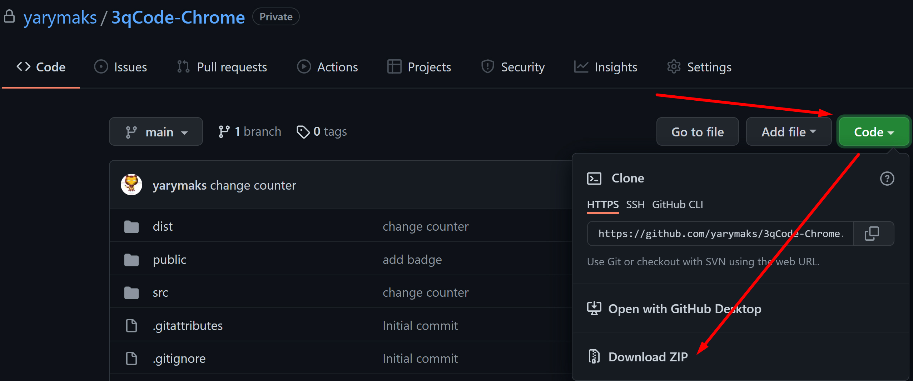
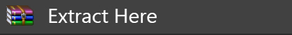
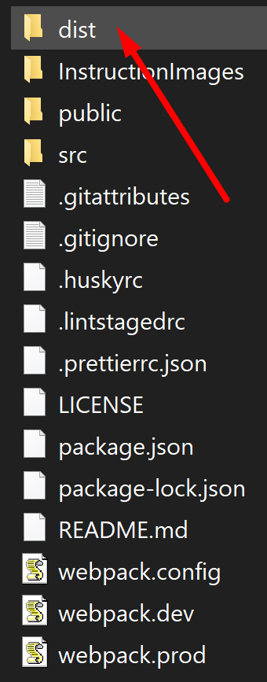
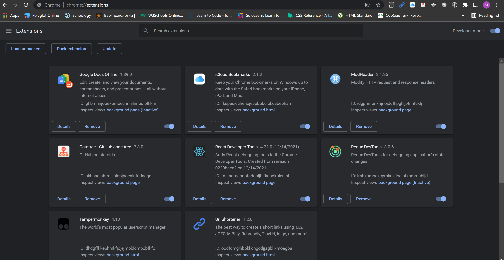
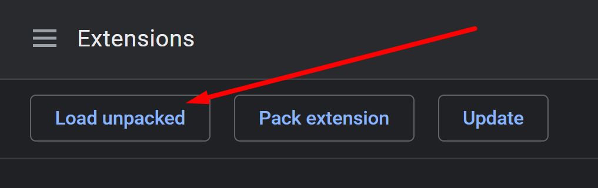
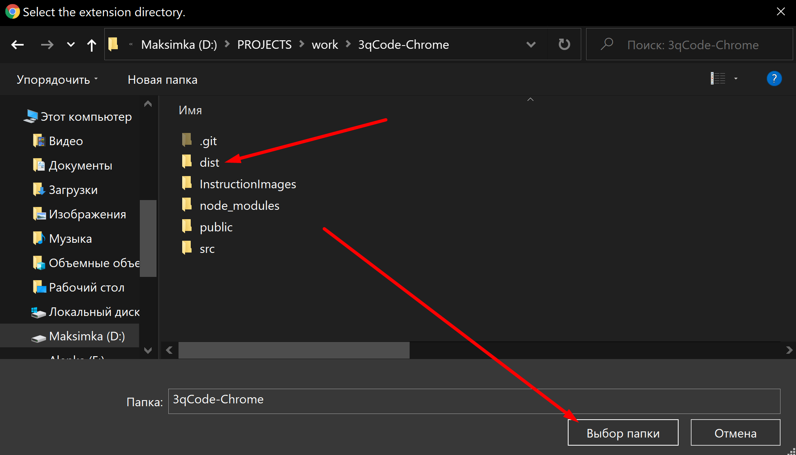
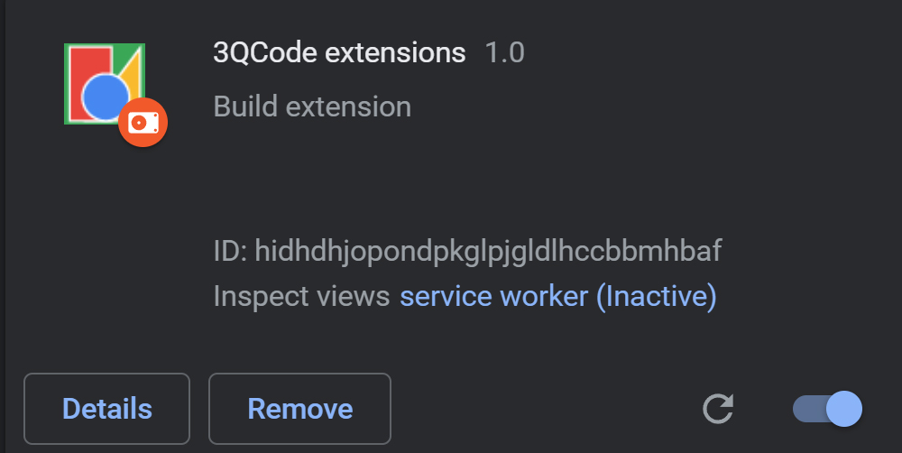
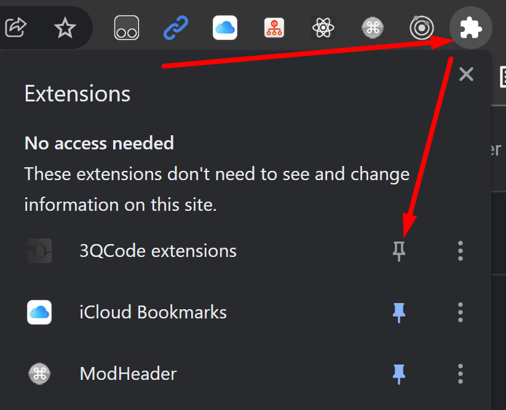
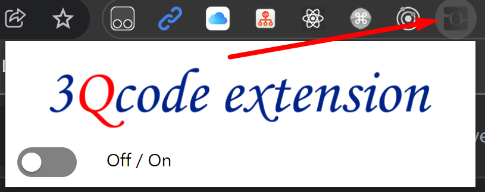
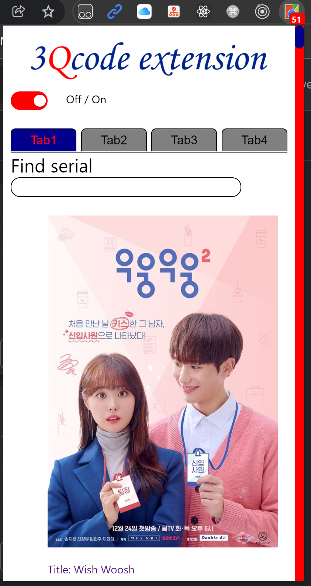

# 3qCode-Chrome extension

## Uruchomienie wtyczki do Google Chrome

Dla uruchomienia wtyczki w Google Chrome jest Ci potrzebny archiwum projekta.



Po pobraniu projektu wypakuj archiwum do swojego folderu.



Po rozpakowywaniu archiwum będzie Ci potrzebny folder `dist`.



Dalej, otwórz przęglądarkę Google Chrome. Przejdż po adresu.

```
chrome://extensions/
```

Otworze się strona z twoimi wtyczkami.



W lewym górnym rogu znajduje się przycisk Load unpacked.



W oknie przejdż do adresu foldera w którym znajduje się folder dist. Zaznać
folder lewym jednym przyciskiem myszki i kliknij otwórz folder.



Wtyczka została dodana.



Aby przypnąć wtyczkę obok paska wyszukiwania. Kliknij "puzzle" (patrz na zdjęcie
niżej).



Wtyczka się pojawi na pasku wtyczek.(Szara ikonka)



Aby urochomić wtyczkę kliknij przełącznik w pozycju On. Zmieni się ikonka na
kolorową.



### Wtyczka została dodana do Google Chrome i urochomiona
